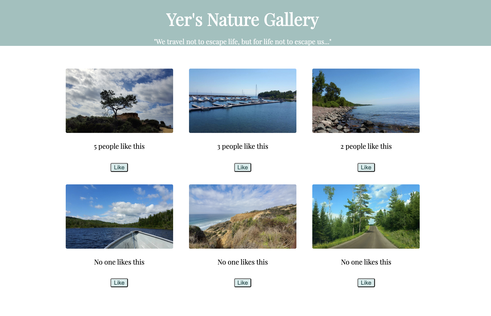

<!--  -->

# REACT GALLERY 

## Description

_Duration: 30 hours

## Screen Shot

### Prerequisites

* [Node.js](https://nodejs.org/en/)
* Nodemon

## Installation

1. Click on `Use Template` button from PrimeAcademy/react-gallery
2. Open up your editor of choice and run an `npm install`
3. Run `npm run server` in your terminal
4. Run `npm run client` in your terminal
    - The `npm run client` command will open up a new browser tab for you!

## Usage

1. Open browser
2. Browse through gallery of images
3. Click on button `Like` upon your taste of image

## Built With

* React 
* Express
* Node.js

## Acknowledgement
Thanks to [Prime Digital Academy](www.primeacademy.io) who equipped and helped me to make this application a reality.

## Support
If you have suggestions or issues, please email me at [maivyerthao@gmail.com](www.google.com)